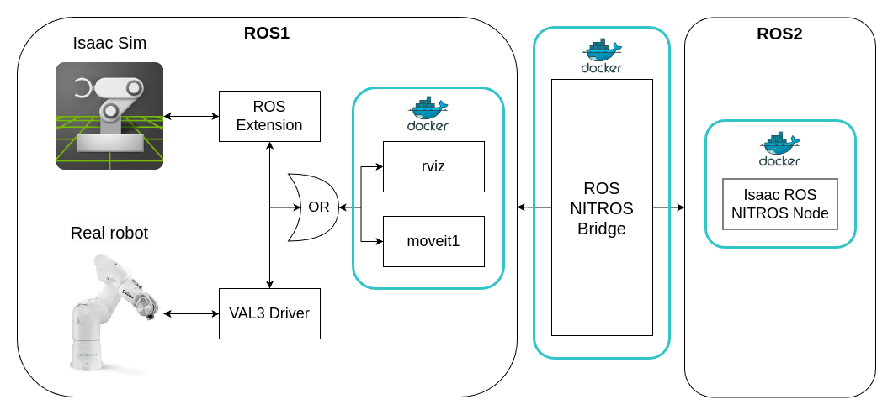

# Stäubli TX2-60L ROS1 with Isaac Sim
## Table of Contents
- [Installation](#installation)
- [System overview](#system-overview)
- [Usage](#usage)
    - [Moveit controller](#moveit-controller)
    - [Isaac ROS NITROS bridge](#isaac-ros-nitros-bridge)
- [Step-by-step tutorial](#step-by-step-tutorial)
- [Configuration](#configuration)
    - [Yolov8](#yolov8)
    - [Detectnet](#detectnet)
- [Limitations](#limitations)

## Installation
Once the repository is cloned, navigate to the cloned directory into the ros1_ws/ and run the following command to build the Docker containers:
```bash
tmuxp load tmuxp_configs/build_yolov8.yml
```
This command will build the Docker containers for using the ROS NITROS bridge and all the necessary dependencies for the Staubli TX2-60L robot. The build process will take some time, so be patient.

## System overview

<div style="text-align:center">

</div>

The system consists of the following components:
- **Isaac Sim**: NVIDIA Isaac Sim is used to simulate the Staubli TX2-60L robot. The Isaac Sim is connected to ROS1 to communicate with the ROS1 environment.
- **Real robot**: The real robot can be communicated with the use of the VAL3 Driver. The VAL3 Driver is used to communicate with the real robot and the ROS1 environment.
- **ROS NITROS bridge**: The ROS NITROS bridge is used to connect the ROS1 environment with the ROS2 environment. Images can be transferred from ROS1 to ROS2 and vice versa with zero-copy. This enables GPU-accelerated image processing in ROS2. 
- **Isaac ROS NITROS Node**: A GPU-accelerated image processing node can be used to process images coming from the ROS1 environment. In this repo a simple example for object detection using YOLOv8 or detectnet is provided.
- **Moveit**: Moveit is used to control the robot in simulation and in the real world. 
- **Rviz**: Rviz is used to visualize the robot and the environment.

Components surrounded by a blue line are part of seperate Docker containers. The Docker containers are connected with the use of a Docker network. The Docker network is used to communicate between the different components.

For a better understanding of the Isaac ROS NITROS bridge, take a look at the official documentation [here](https://nvidia-isaac-ros.github.io/repositories_and_packages/isaac_ros_nitros_bridge/index.html).


## Usage
### Moveit controller
Once the Docker containers are built, you can start to control the robot either in simulation or in the real world. To control the robot in simulation, you will need to start the Isaac Sim with the Omniverse launcher and select the omni.isaac.ros_bridge as the ROS Bridge Extension. Once the Isaac Sim is running, you can open the scene located in ```ros1_ws/isaac_sim/scenes/staubli_tx2_60l_vrlab.usd```.

After that you can start the moveit controller with the following command:
```bash
tmuxp load tmuxp_configs/run_sim.yml
```
This command will start the moveit controller and rviz. You can now control the robot with the moveit interface.

<div style="text-align:center">

</div>

If you want to control the real robot, you need to connect the robot LAN cable with your computer and run the controller with the following command:
```bash
tmuxp load tmuxp_configs/run_real.yml
```
This command will start the moveit controller and rviz. You can now control the robot with the moveit interface.

<div style="text-align:center">

</div>

### Isaac ROS NITROS bridge

To test the Isaac ROS NITROS bridge, a simple example for object detection using YOLOv8 or detectnet is provided. To run the object YOLOv8 detection example for a usb_cam, you can use the following command (it can take some time to start publishing the image):
```bash
tmuxp load tmuxp_configs/yolov8.yml
```
This command will start the usb_cam and the YOLOv8 object detection. You can now see the processed image with rqt_image_view.

<div style="text-align:center">

</div>

Assuming you already started the simulation with Isaac Sim, you can also test it with the following command:
```bash
tmuxp load tmuxp_configs/yolov8_sim.yml
```

<div style="text-align:center">

</div>

## Step-by-step tutorial 

For a quick look at how to install and use the moveit system, take a look at the following video (click to open):

<div align="center">
   <video src="https://github.com/user-attachments/assets/28f86546-d358-4b1a-9d29-2fd4a33d4200" controls width=70%></video>
</div>

## Configuration
### Yolov8
The Yolov8 model used in this repository only supports an input image size of 640x640 pixels. The image pipeline is configured to resize the input image to 640x640 pixels before the object detection.
Several parameters need to be adjusted for the YOLOv8 object detection if you want to use different input images. In the compose files [```ros1_ws/docker/yolov8_compose.yml```](/ros1_ws/docker/yolov8_compose.yml) or  [```ros1_ws/docker/yolov8_sim_compose.yml```](/ros1_ws/docker/yolov8_sim_compose.yml) you have to adjust the following parameters in those services:
- `ros2_object_detection`: 
    - `image_topic`: The image topic you want to use for object detection in the ROS2 environment.
    - `camera_info_topic`: The camera info topic you want to use for object detection in the ROS2 environment. 

- `bridge`: 
    - `pub_image_name`: The image topic that is bridged between ROS1 and ROS2 with the use of the ROS NITROS bridge. Should be the same as `image_topic` defined in the `ros2_object_detection`. 
    - `sub_image_name`: The image topic that is bridged from the object detection node to ROS1. Change it to whatever topic your custom image processing node is publishing. The output topic in the ROS1 environment is `/ros1_output_image`.

- `ros1_camera` (assuming you use usb_cam package): 
    - `image_view`: boolean value to visualize the image in the ROS1 environment. Set it to `true` if you want to visualize the image in the ROS1 environment.
    - `config_file`: The config file for the usb_cam package. You can find the config file in the [```usb_cam package```](/ros1_ws/src/usb_cam/config/). You can adapt a file to your needs.

- `image_view` (sim compose file):
    - `topic`: The image topic you want to visualize in the ROS1 environment. Since the output topic in the ROS1 environment is `/ros1_output_image`, you should leave it at `/ros1_output_image`.

### Detectnet

The model used in this repository comes from the [isaac ros examples](https://nvidia-isaac-ros.github.io/repositories_and_packages/isaac_ros_object_detection/isaac_ros_detectnet/index.html). The image pipeline is configured to resize the input image to 800x600 pixels before the object detection.
Several parameters need to be adjusted for the detectnet object detection if you want to use different input images. In the compose files [```ros1_ws/docker/detectnet_compose.yml```](/ros1_ws/docker/detectnet_compose.yml) or  [```ros1_ws/docker/detectnet_sim_compose.yml```](/ros1_ws/docker/detectnet_sim_compose.yml) you have to adjust the following parameters in those services:

- `ros2_object_detection`: 
    - `image_topic`: The image topic you want to use for object detection in the ROS2 environment.
    - `camera_info_topic`: The camera info topic you want to use for object detection in the ROS2 environment.

- `bridge`:
    - `pub_image_name`: The image topic that is bridged between ROS1 and ROS2 with the use of the ROS NITROS bridge. Should be the same as `image_topic` defined in the `ros2_object_detection`. 
    - `sub_image_name`: The image topic that is bridged from the object detection node to ROS1. Change it to whatever topic your custom image processing node is publishing. The output topic in the ROS1 environment is `/ros1_output_image`.

- `ros1_camera` (assuming you use usb_cam package):
    - `image_view`: boolean value to visualize the image in the ROS1 environment. Set it to `true` if you want to visualize the image in the ROS1 environment.
    - `config_file`: The config file for the usb_cam package. You can find the config file in the [```usb_cam package```](/ros1_ws/src/usb_cam/config/). You can adapt a file to your needs.

- `image_view` (sim compose file):
    - `topic`: The image topic you want to visualize in the ROS1 environment. Since the output topic in the ROS1 environment is `/ros1_output_image`, you should leave it at `/ros1_output_image`.

## Limitations

- The YOLOv8 model used in this repository only supports an input image size of 640x640 pixels. This is due to the pretrained model used in the object detection node. The image pipeline is configured to resize the input image to 640x640 pixels before the object detection. 

- It can happen that the bridged image topic in ROS1 is stuttery if one uses Isaac Sim. 
